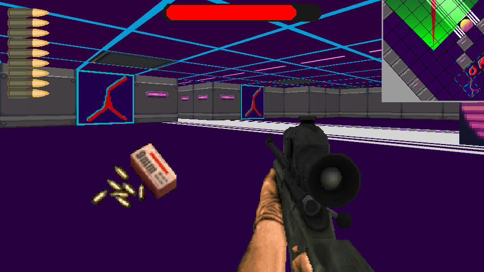

# Cyber Slayer

## A futuristic cyberpunk inspired FPS game

> Coming Soon

#### Screenshots

|  |  |
|-----------------------------------|-----------------------------------|
|  |  |

##### Desktop


##### Android
[](https://www.youtube.com/watch?v=DDC0JBW6rxM)


#### Game controls

- Player movement : zqsd
- Camera movement : mouse
- Jump : space bar
- Run : hold Left Shift
- Shoot : left mouse click
- Aim : right mouse click
- Change weapon : mouse wheel


#### Install

To install, you need : 

- SFML2.5 installed
- CMake version >= 3.10
- A C++17 compiler (gcc or msvc, not tested with clang)

Run the following commands to clone and build 

```bash
git clone --recurse https://github.com/Madour/CyberSlayer
cd CyberSlayer
mkdir build && cd build
cmake .. -DCMAKE_BUILD_TYPE=Release
cmake --build . --config Release
```

You'll maybe get some warnings when compiling (type conversion from float to int / int to float), you can ignore them.

#### Misc

- Choosing an antialiasing higher than 0 may cause valgrind to detect memory leaks, otherwise there are none

#### Authors

- Modar Nasser
- Paul Fourcade

---
